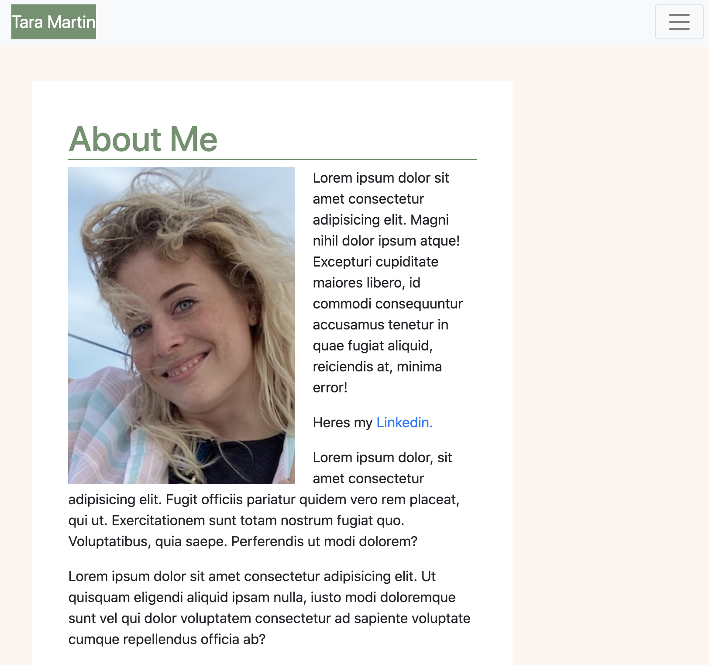
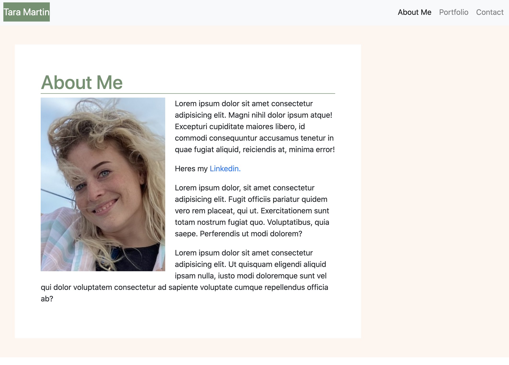
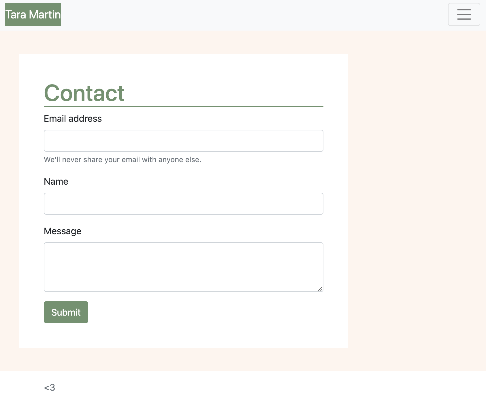
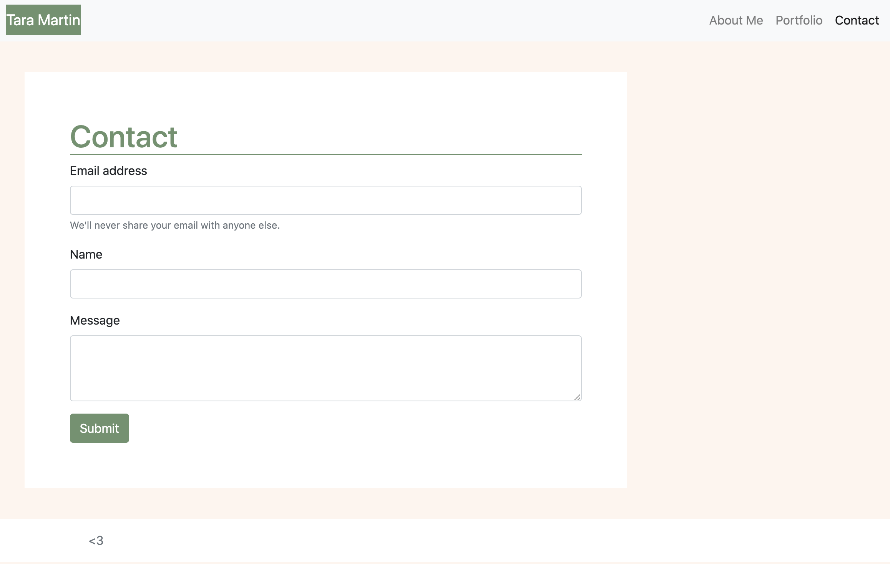
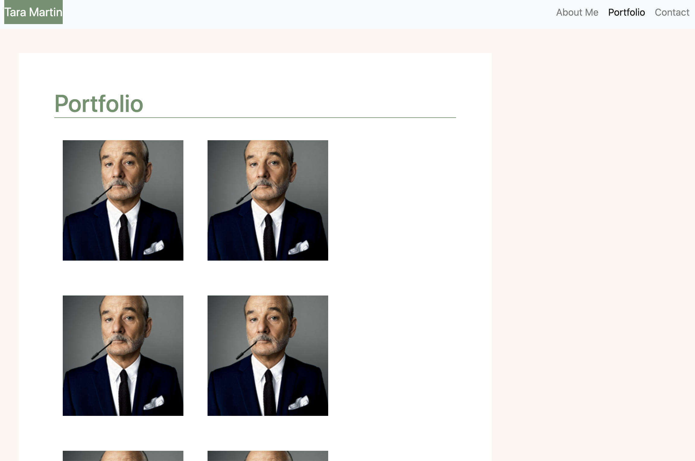
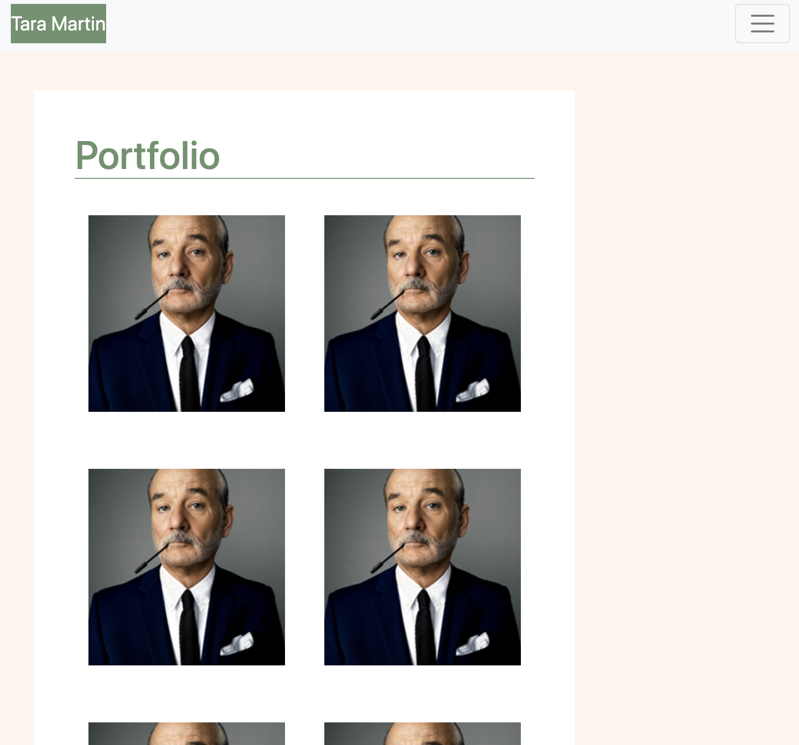

# taramartin_portfolio

## Description

This portfolio will be used to display the projects made while at Georgia Techs' Coding BootCamp. It is also a tool to dispaly my understanding of css, html and bootstrap. The portfolio has an About Me page, a Contact page and a Portfolio page. Each page is designed to market myself to future employers.

## Screenshot

## Acceptance_Criteria

- Functional, deployed application

- GitHub repository with README describing the project

- Navbar must be consistent on each page.

- Navbar on each page must contain links to Home/About, Contact, and Portfolio pages.

- All links must work.

- Must use semantic html.

- Each page must have valid and correct HTML. (use a validation service)

- Must contain your personalized information. (bio, name, images, links to social media, etc.)

- Must properly utilize Bootstrap components and grid system.

## Instillation

1. Please visit my Github page - user name is martintara117.
2. Once there, clone my repository for "taramartin_portfolio".
3. After you have cloned, you may add it to your repository.
4. From there, you will git pull and type code . to open Visual Studio Code to edit.

## Usage

Please view gif to see the how the quiz performance.

To view live visit: [click here.](https://martintara117.github.io/taramartin_portfolio/)

One may also view locally by following the above installation steps and opening [index.html](index.html) in your browser.

## Credits

Credit goes to Georgia Tech Coding Boot Camp - for providing the intial html and css to be edited.
Finalized by Tara Martin

## Contributing
